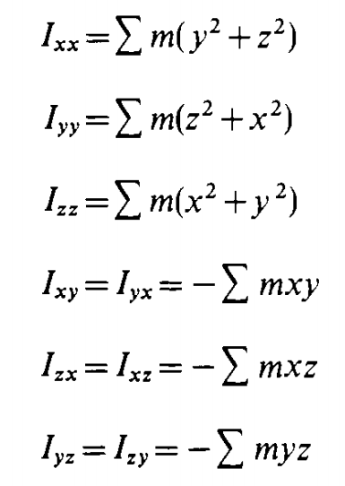
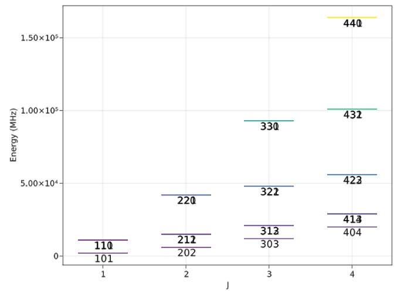
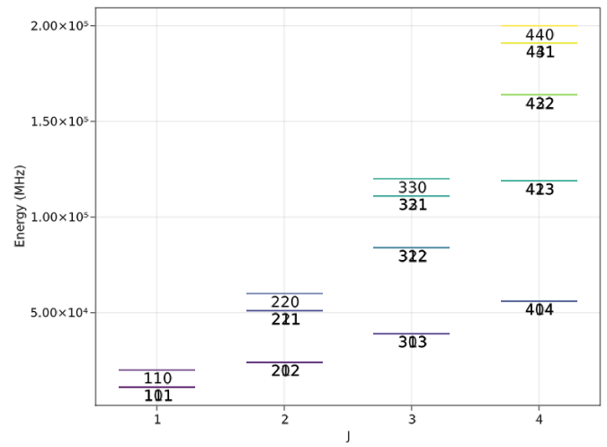
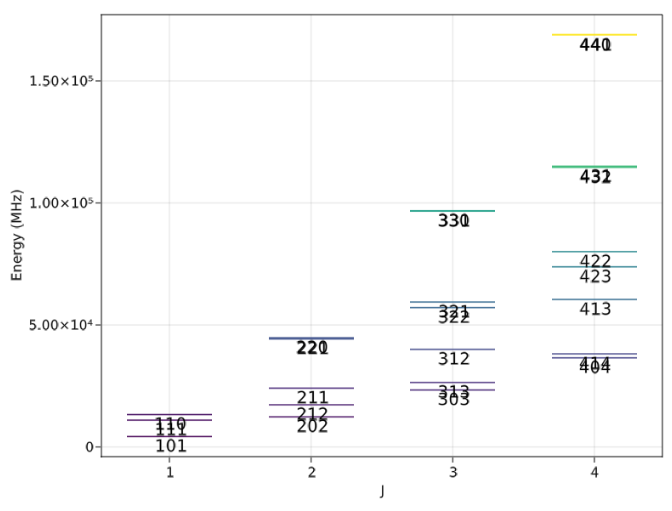

# Rigid rotor


The rigid rotor is the basic approximation to computing the rotational motions of
molecules: we assume that the molecule does not distort as it rotates, and the
energy associated with rotation correspond with the moments of inertia of the molecule.

We start with the classical equations for angular momentum and energy, from [[gordy-cook]]
Chapter 1:

$$\bf{P} = \bf{I} \cdot \omega$$

with angular velocity $\omega$ and moment of inertia tensor $\bf{I}$; for a molecule in $xyz$ coordinates with atom masses $m$, the matrix elements are (taken again from [[gordy-cook]]):



A Python implementation would look like:

```python
# for an atom objects with mass and xyz coordinates
def i_xx(atoms: Atom) -> float:
    return sum([atom.mass * (atom.y**2 + atom.z**2) for atom in atoms])
```

...and the rest of the tensor follows. Like everything else in nature, things are simpler when
this matrix is diagonal, which is found when the molecule is rotated to align with
its *principal axes*, where $xyz$ align with how the mass is distributed throughout
the molecule. If that's the case, the energy associated with rotation is given by:

$$E_r = \frac{1}{2}I_x \omega_x^2 + \frac{1}{2}I_y \omega_y^2 + \frac{1}{2}I_z \omega_z^2$$

where $I_x, I_y$, and $I_z$ are the principal moments of inertia.

## Linear molecules

- One unique moment of inertia, leads to a single rotational constant $B$.
- The energy level expression is given by:

$$E(J) = BJ(J+1)$$

### Behavior

As simple as they come&mdash;the rigid linear rotor has harmonically spaced energy levels: every energy level is given by some quadratically increasing multiple of $J$.

## Symmetric tops

- Chapter 6 of [[gordy-cook]]
- Two unique moments of inertia, leads to two rotational constants: $A$ and $B$&mdash;notation may differ where some programs use $B$ and $C$ instead, for example `PGopher`. In the case of `PGopher`, $C$ corresponds to the top axis (i.e. the one with the most mass).
- Two quantum numbers needed to uniquely represent each energy level: $J$ for total rotation, $K$ for the projection of $J$ onto the top axis.
- The symmetric top Hamiltonian is also diagonal in a $J,K$ basis, and so to get the energy levels you just need to use analytic expressions:

$$E(J,K)=BJ(J+1) + (A - B) K^2$$

...a corresponding one including [[centrifugal-distortion]] is also available.

### Behavior

- Transitions with $\Delta K \neq 0$ are not observed for rigid rotors; you need [[centrifugal-distortion]]

## Asymmetric tops

- No analytic expression is available, and we have to solve it numerically using matrix methods.
- Within a symmetric top basis (i.e. $J,K$), the asymmetric rotor Hamiltonian is block-diagonal, meaning there are no off-diagonal elements between $J$ levels.

### Behavior

The energy level structure changes based on how asymmetric the molecule is between two limits: the [[prolate]] and [[oblate]] limits. A convenient metric is Ray's [[asymmetry-parameter]].

In the prolate limit ($\kappa=-1$), with quantum numbers $J, K_a, K_c$:



...and in the oblate limit ($\kappa=1$):



the biggest difference is the ordering of the energy levels swap between the two within a value of $J$ (e.g. look at the $J=3$ stack), and effectively which energy levels are degenerate (overlapping).

Finally, in the perfectly asymmetric case:



...the energy level structure is significantly more complicated, as the degeneracy of $K$ levels are lifted; this is referred to as asymmetry or $K$-splitting.