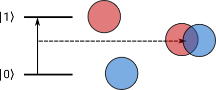
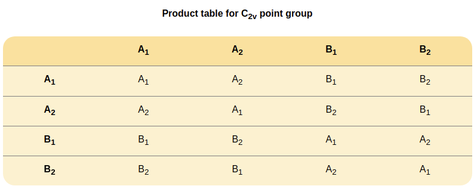
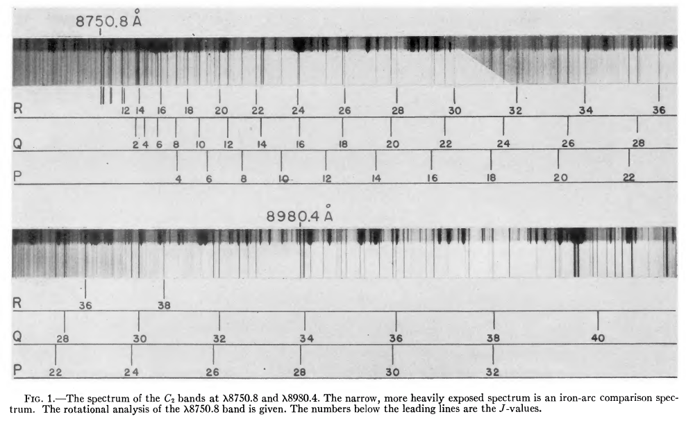
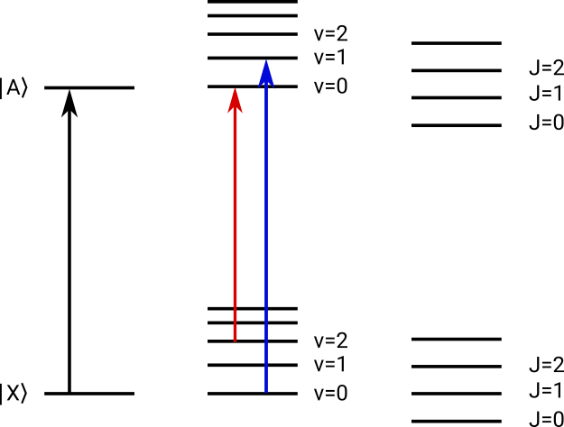
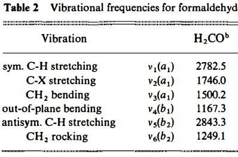
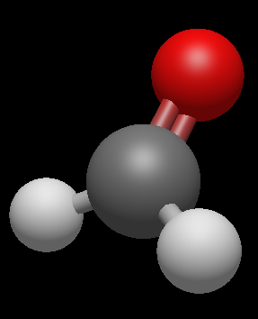
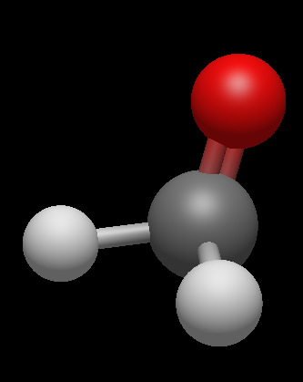
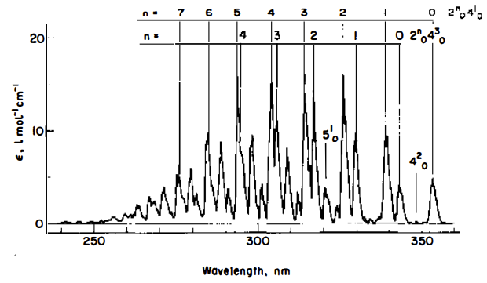
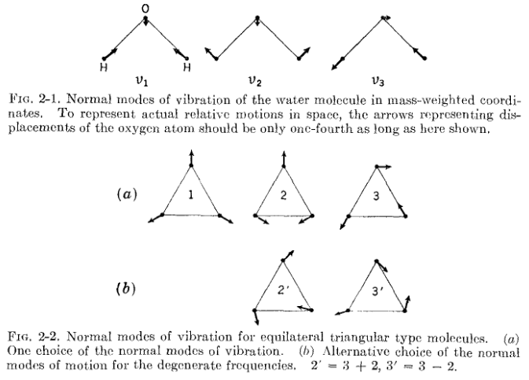
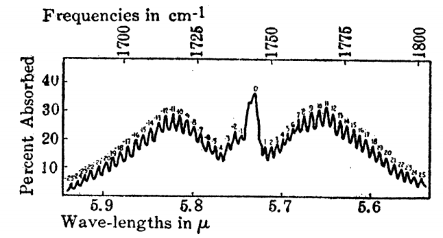

# Crash Landing on Spectroscopy

### Everything you need to speak the language

_A primer by Kelvin Lee_&mdash;Dec. 2021

---

# Things covered

- Qualitative description of one-photon transitions
- Closed-shell; no fine-structure/radicals
- Assumed undergraduate spectroscopy

---

# What, why, and how

- Spectroscopy as interaction of light with matter; atoms and molecules
- Control chemical reactions, quantify molecules, fundamental chemical physics
- Comprise the whole electromagnetic spectrum to do different tasks; excite 

----

# Basis for spectroscopy

Molecules and atoms have multiple *degrees of freedom* for motion; in order of energy:

1. Electronic (energy of moving electrons)
2. Vibrational (energy of moving nuclei)
3. Rotational (energy of rotating the whole molecule)
4. Nuclear spin

----

# Best equation

The Schrodinger equation comprises a Hamiltonian operator, $\hat{H}$, that gives the total energy of a system described by wavefunctions $\Psi$:

$$\hat{H}\Psi = \rm{E}\Psi$$

We never work on this equation as is: we break it up into separable components that we can actually solve:

$$\hat{H} = \hat{H}_\mathrm{elec} + \hat{H}_\mathrm{vib} + \hat{H}_\mathrm{rot} + \hat{H}_\mathrm{ns}$$

----

The hardest problems are the ones that involve multiple types of *coupled* motion:

- The vibrating-rotating molecule: $\hat{H} = \hat{H}_\mathrm{vib} + \hat{H}_\mathrm{rot} + \hat{H}_\mathrm{rovib}$
- Vibronic motion: $\hat{H} = \hat{H}_\mathrm{vib} + \hat{H}_\mathrm{elec} + \hat{H}_\mathrm{vibro}$

You have to solve not only the separable parts, but also additional *coupling* between different degrees of freedom; i.e. how each motion influences the other.

----

# How solve tho

$\hat{H}$ is an operator; in linear algebra operators are matrices, and "solving" the equation is a matter of matrix-matrix products and sums.

Most of the hard work is in deriving the matrix elements with symbolic math. With modern computers, no one should ever need to do matrix operations by hand!

----

Solving the Schrodinger equation of a system gives us the energy levels and the wavefunctions, which are meant to represent *observables*; things that we can measure.

We seldom observe energy levels directly, but we see *transitions* between energy levels, and the intensity of a transition is directly proportional to the overlap integral of two wavefunctions, $\langle 0 \vert 1 \rangle$, or the inner product of two vectors, and a transition moment operator.

----

# Group theory

Symmetry is embedded into everything we do in quantum mechanics and spectroscopy: it can simplify *or* complicate things.

For example, we can qualitatively tell if a transition will have observable intensity simply through group theory: if and only if the symmetry product of the two wavefunctions is the totally symmetric representation.

----

For $\psi_1 = A_2, \psi_2 = B_2, \psi_3 = A_2$, we can immediately tell which transitions are allowed ($\psi_1 \otimes \psi_3=A_2 \otimes A_2=A_1$).

Ground state is always the totally symmetric representation.

----

Symmetry in general tells us how many things we will need to think about: the goal of symmetry is to decrease the amount of expected work (or not).

For example, things that are equivalent by symmetry tell us they may be *degenerate*, i.e. they have the same energy

---

# Electronic spectroscopy

- Motion of electrons; *a la* moving electrons between "orbitals"
- Typically high energy:
  - 10's of thousands of wavenumbers (cm$^{-1}$)
  - Near-IR to 10's of nanometers
  - Often expressed as electron volts (eV); the kinetic energy of an electron accelerated by one volt of potential in vacuum
- Usually the most complex when rotationally and vibrationally resolved (the whole shebang)
- Can have as many electronic transitions as you do places to put electrons in ("orbitals"), also Rydberg series
- For polyatomic molecules, $\tilde{X}$ refers to the ground electronic state, with higher excited states following $\tilde{A},\tilde{B},\cdots$

----

## Example in dicarbon

C$_2$ is ubiquitous in flames and in the spectra of comets

Electronic ground state is $X ^1\Sigma_g$, and the first singlet excited state is $X~^1\Pi_u$

----

  <iframe src="https://www.webqc.org/symmetrypointgroup-d_h.html" height=500 width=700 alt="https://www.webqc.org/symmetrypointgroup-d_h.html">
  </iframe>

$$\langle {X} \vert \mu \vert {A} \rangle = \Sigma_g \otimes \Pi_u \otimes \Pi_u = \Sigma_g$$

The math checks out!

----

[DOI](https://doi.org/10.1086/145023)

----

We see transitions between electronic, vibrational, and rotational levels!

----

## Example in formaldehyde

- First electronic transition ($\tilde{X}\rightarrow\tilde{A}$, $n\rightarrow\pi^*$) is symmetry forbidden
  - $A_1$ ground state, $A_2$ excited state
- Transition is allowed when we couple vibrational motion (which ones?)
  - $\langle \tilde{X} \vert \mu \vert A \rangle = A_1 \otimes (A_1, B_1, B_2) \otimes A_2$

----

Formaldehyde is a classic example of *vibronic coupling*; an electronic transition becomes symmetry allowed because vibrational excitation along certain modes!

To complicate things further, the $\tilde{A}$ state of formaldehyde is incredibly bent out of shape!

----

Ground state

----

$\tilde{A}$ state

----

So $\tilde{X},v=0 \rightarrow \tilde{A},v=0$ is forbidden and not easily observed, we see the strongest transitions are promoted by vibrations that:

1. Make it symmetry allowed ($b_1$ and $b_2$ modes)
2. Meet the excited half way in geometry (out-of-plane)

The second point improves nuclear wavefunction overlap, which makes the transition more intense. This is known as the *Franck-Condon* principle.

----

Intensity patterns dictated by wavefunction overlap between ground and excited state.

---

## Vibrational spectroscopy

- Motion of nuclei; bonds, angles, dihedrals vibrating
- Spans far- and mid-infrared wavelengths
  - 100&ndash;5000ish wavenumbers (cm$^{-1}$)
  - How many microns?
- Read *Wilson, Decius, and Cross*: the bible of vibrational spectroscopy

----

# Nuclear degrees of freedom

In 3D space, each nucleus $N$ has $x,y,z$ directions to travel. Therefore, a molecule has $3N$ degrees of nuclear freedom.

...However, not all of them correspond to vibrations!

Collectively, a molecule can translate and rotate in space: the relative positions of each nucleus is unchanged, and therefore not a vibration. For non-linear, polyatomic molecules, we therefore have $3N-6$ vibrational degrees of freedom.

(These are also called the [Eckart conditions](https://en.wikipedia.org/wiki/Eckart_conditions))

----

# Internal coordinates

This is the common form (or basis) for describing vibrational motions of a molecule: bonds, angles, and dihedrals make better descriptions than atomic coordinates.

Which bonds, angles, dihedrals are used is arbitrary (called redundant internal coordinates), but there is a unique set of *Normal modes* that can be determined through group theory (not doing it today lol).

----

From *Wilson, Decius, and Cross*

----

# Vibrational frequencies

Classical treatment of a vibrating molecule is to use the simple harmonic oscillator model: atoms move along a *normal coordinate*, $Q$, in a periodic fashion.

The energy levels of a harmonic oscillator are in the familiar form:

$E_\mathrm{vib} = h\nu(n + \frac{1}{2})$

for a normal/vibrational mode $\nu$, with $n$ quanta of excitation.

----

## $FG$ method

Computing the fundamental vibrational frequencies involves constructing two matrices, and diagonalizing their product to obtain eigenvalues (which are the vibrational frequencies). This is actually how computational chemistry codes calculate harmonic frequencies!

See Chapter 4 of *Wilson, Decius, and Cross*.

----

The $F$ matrix corresponds to the force constants: the derivative of the potential energy w.r.t. each normal mode, and the $G$ matrix contains matrix elements that represent the internal coordinate basis, which depends on bonds/angles/dihedrals:

$$G_{ij} = \sum_{\alpha=1}^N\frac{\mathcal{s}_{i}\cdot\mathcal{s}_j}{m_\alpha}$$

for mass and scalar product of the internal coordinate vectors $\mathcal{s}$ for atom $\alpha$, for $i,j$ running over each internal coordinate (i.e. one matrix element per pair of internal coordinates).

----

## Zero point energy

For $n=0$, the harmonic oscillator equation says each vibrational mode of a molecule has $\frac{1}{2}\nu$ worth of energy, such that the molecule with $N$ vibrational modes has:

$E_\mathrm{zpe} = \frac{1}{2}\sum_{k=1}^{3N-6} \nu_k$

worth of energy, even in the ground vibrational state. This is referred to as the *zero-point energy*.

----

## Nomenclature

- $\nu$ is used to denote a normal mode: e.g. $\nu_4$ of formaldehyde
- $v$ is used to denote the number of quanta: e.g. $2\nu_4$ is two quanta of $\nu_4$
- Fundamental transitions/frequencies correspond to exactly one quantum ($v$) in a mode ($\nu$)
- Overtones transitions/frequencies correspond to multiple quanta ($v$) in a given mode ($\nu$)
- Combination transitions/bands correspond to exciting multiple modes, $\nu$

----

# Intensities of vibrational transitions

Intensities are the same as any other: overlap integrals between vibrational wavefunctions, and a transition moment operator. For vibrations, the former depends on what basis we work in (e.g. harmonic oscillator), and the latter depends on how the dipole moment changes with respect to the nuclei:

$$\mu_x = \mu^0_x + \sum_{k=1}^{3N-6} \mu_x^k Q_k $$

where $\mu_x^k = \frac{\partial \mu_x}{\partial Q_k}_0$, as in the derivative of the electric dipole moment w.r.t. normal mode coordinate $Q_k$. For linear algebra reasons, the equilibrium dipole moment $\mu^0$ cancels, and they do not influence vibrational intensities.

----

## Example in formaldehyde

In the simplest case, e.g. $\nu_2$ the C=O stretch:

we have beautiful $P,Q,R$ branches ($\Delta J=0,\pm1$). The pure vibrational transition lies underneath, and everything else is a rovibrational transition.

---

## Rotational spectroscopy

